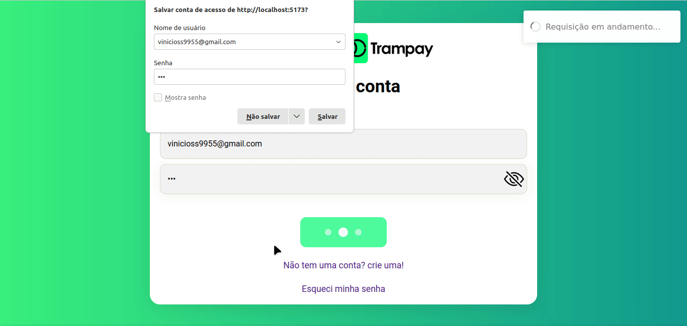

# Desafio Trampay

<div align="center">

  <h3>Construído com</h3>

  
  
  
  
  
</div>

<br/>

# Descrição

Desafio técnico do processo seletivo da Trampay.

# Back-End do projeto

[Link Repositório Back-End](https://github.com/ThVinicius/trampay-back-end)

# Deploy

- [Link Deploy FrontEnd](https://desafio-trampay-thvinicius.vercel.app/)

## Funções

- Criar uma conta
- Acessar uma conta
- Recuperar a senha
- Enviar um CSV ao back-end
  - Na pasta public/csv estão alguns exemplos de arquivos csv aceitos pelo back-end

<h1 align="center" >

</h1>

## Rodar localmente

Versão do node: 18.15.0

Crie um arquivo chamado `.env` na raiz do projeto com a seguinte varivael de ambiente:

- VITE_BASE_API_URL: url do back-end sem a barra no final
  - Ex: VITE_BASE_API_URL=http://localhost:3000

Instale as dependências

```bash
  npm install
```

Inicie o servidor

```bash
  npm run dev
```

</br>

## Acknowledgements

- [Awesome Badges](https://github.com/Envoy-VC/awesome-badges)
